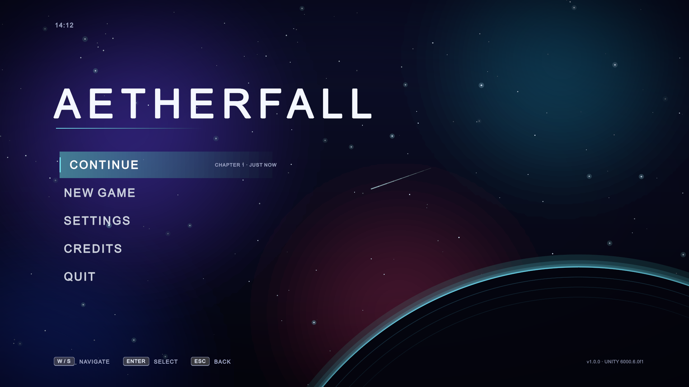
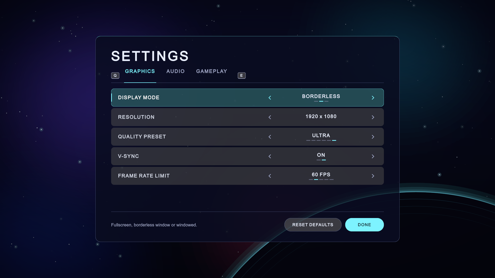
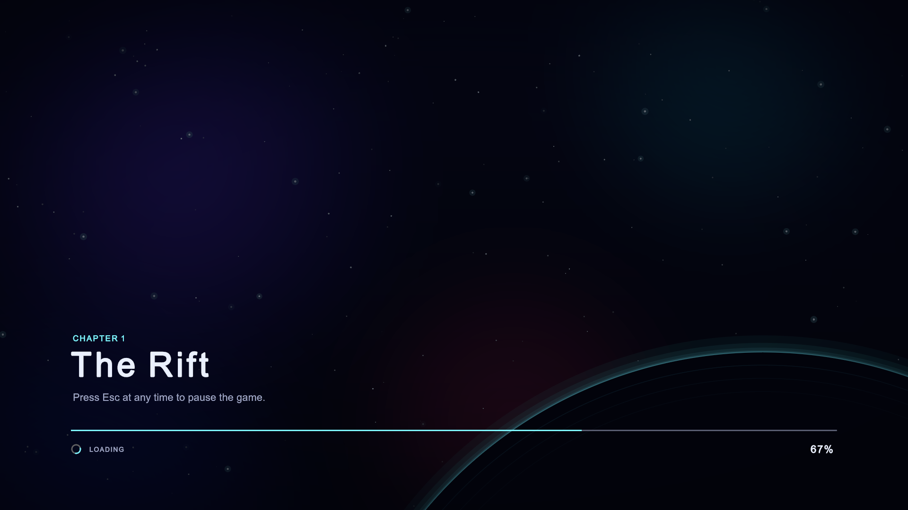
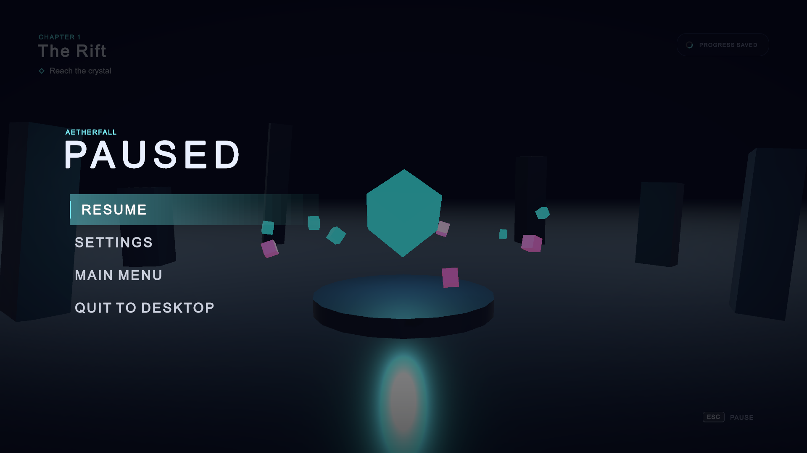

# Unity Game Menu

Main menu, settings, loading screen and pause menu for a Unity 6 game (working title Aetherfall). The UI is made with UI Toolkit (UXML + USS), not the old Canvas system.



## Features

- Main menu with Continue, New Game, Settings, Credits and Quit
- Continue is disabled if there's no save
- Settings for graphics, audio and gameplay, saved with PlayerPrefs
- Confirmation popup before starting over or quitting
- Loading screen that loads the game scene in the background
- Pause menu in the game scene (Esc)
- Works with mouse, keyboard and controller

There are no image or sound files in the project. The background is drawn in code and the sounds are generated in `ProceduralAudio.cs`.

## Screenshots







## Running it

1. Open the project in Unity 6000.6.0f1 (other Unity 6 versions should work too).
2. Open `Assets/_Project/Scenes/MainMenu.unity`.
3. Press Play.

To build for Windows use **Tools > Aetherfall > Build Windows Player**. The build goes into `Builds/Windows/`.

## Controls

| | Keyboard | Controller |
|---|---|---|
| Move | Arrow keys / WASD | D-pad / left stick |
| Select | Enter | A |
| Back | Esc | B |
| Change setting | Left / Right | D-pad left / right |
| Switch tab | Q / E | LB / RB |
| Pause | Esc | Start |

## Where things are

- `Assets/_Project/UI` - UXML layouts and USS styles. Colours are defined at the top of `Common.uss`.
- `Assets/_Project/Scripts/Runtime/UI` - menu logic (`MenuController`, `PauseController`, `SettingsView`)
- `Assets/_Project/Scripts/Runtime/Core` - settings and save data
- `Assets/_Project/Scripts/Editor/ProjectSetup.cs` - creates the scenes. Run **Tools > Aetherfall > Rebuild Scenes** if you need to regenerate them.

## Unity MCP

The project has the [MCP for Unity](https://github.com/CoplayDev/unity-mcp) package installed, so Claude Code can talk to the editor. You need [uv](https://docs.astral.sh/uv/) installed. The server starts when Unity opens. To connect Claude Code, run this once in the project folder:

```bash
claude mcp add --scope local --transport http UnityMCP http://127.0.0.1:8080/mcp
```

## Updating the screenshots

The screenshots in `Docs/screenshots` come from running the build with `-capture`:

```bash
Builds/Windows/Aetherfall.exe -screen-width 1920 -screen-height 1080 -capture Docs/screenshots
```
