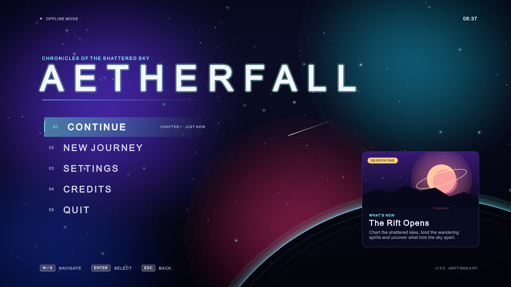
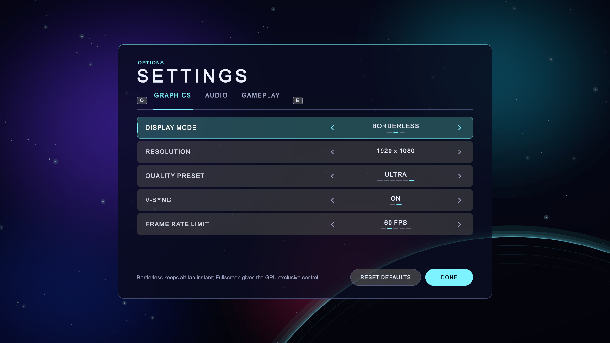
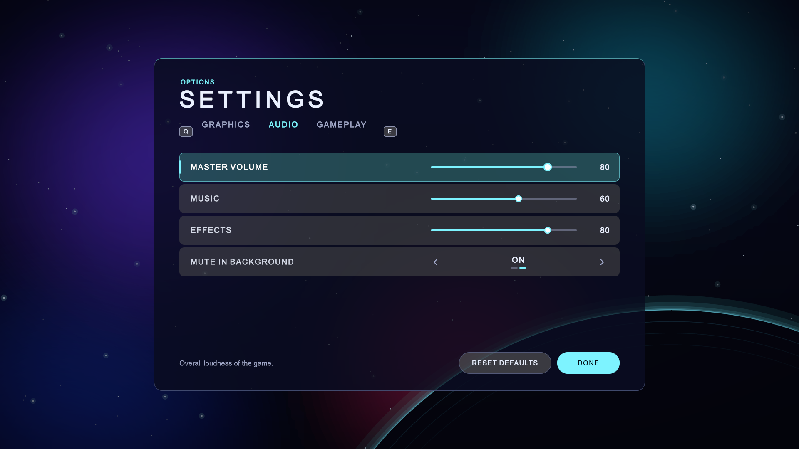
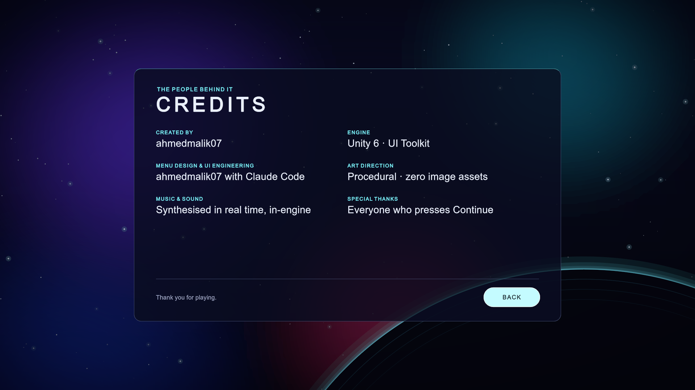
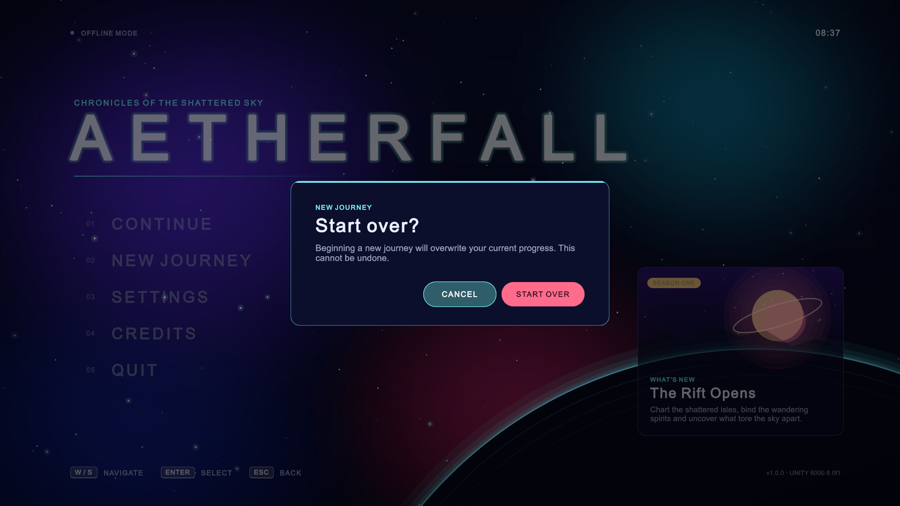
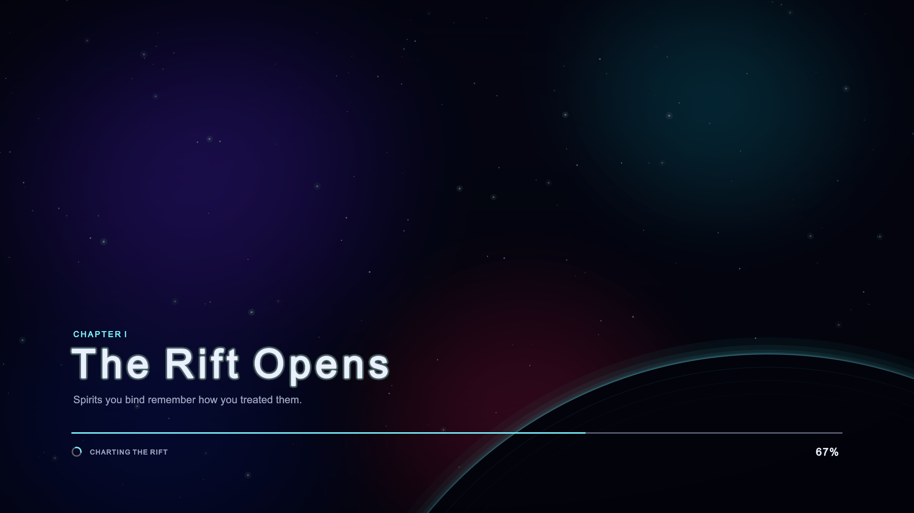
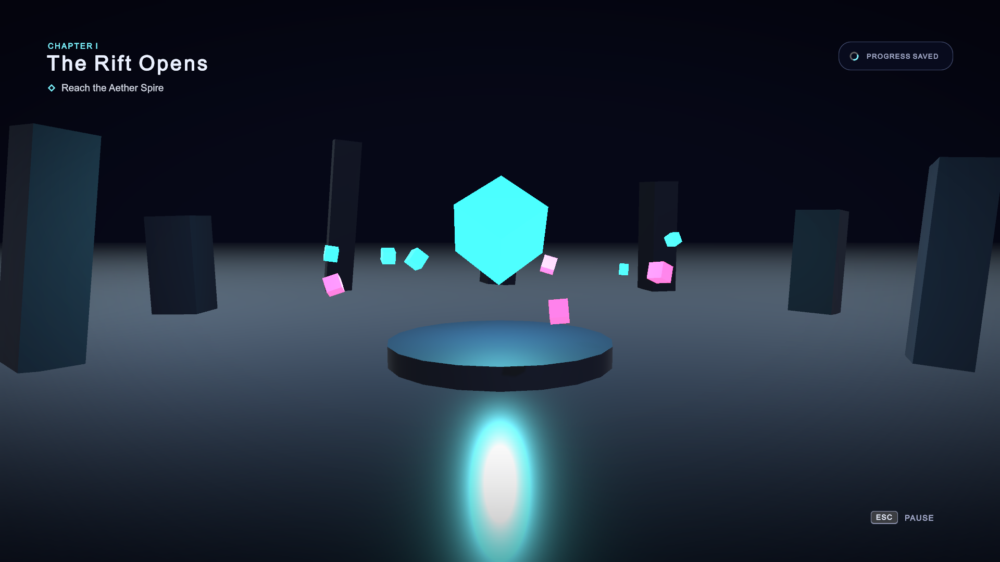
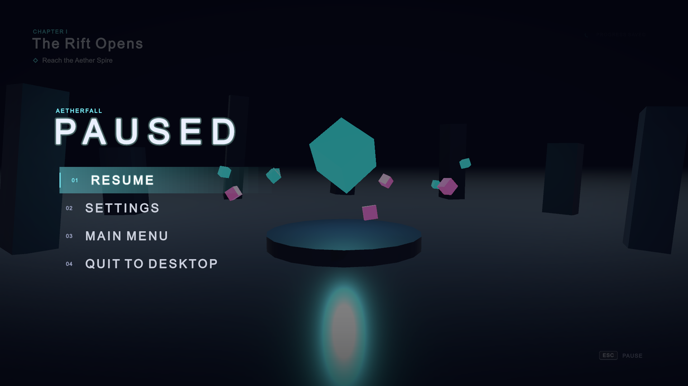

# Aetherfall — Game Menu (Unity 6)

A polished, fully working game menu system for Unity 6, built with **UI Toolkit**. It covers an animated main menu, a tabbed settings screen, credits, confirmation dialogs, a loading screen, an in-game HUD and a pause menu.

Every visual and every sound is generated in code. The project ships **zero image or audio assets**.



## Screenshots

| Settings — Graphics | Settings — Audio |
| --- | --- |
|  |  |

| Settings — Gameplay | Credits |
| --- | --- |
|  |  |

| Confirm dialog | Loading screen |
| --- | --- |
|  |  |

| In-game HUD | Pause menu |
| --- | --- |
|  |  |

> The screenshots are captured automatically by the game itself (see [Regenerating screenshots](#regenerating-screenshots)).

## Features

**Main menu**
- Animated deep-space backdrop: drifting nebulae, twinkling parallax starfield that follows the mouse, shooting stars and a glowing planet horizon
- Staggered intro animation, a live clock and a "What's new" card with procedural key art
- **Continue** shows your chapter and when you last played. It is disabled when there is no save.
- **New Journey** asks for confirmation before overwriting an existing save
- **Quit** asks for confirmation, and the dialog focuses the safe option by default

**Settings** (applied instantly, saved to `PlayerPrefs`)
- Graphics: display mode, resolution, quality preset, V-Sync, frame-rate limit
- Audio: master, music and effects volume, mute when the window is in the background
- Gameplay: difficulty, look sensitivity, invert Y, field of view, subtitles
- A contextual description of the focused setting, plus **Reset Defaults**

**Flow and feedback**
- Loading screen with a real async scene load, a smoothed progress bar, rotating tips and a spinner
- In-game HUD with the objective and a "progress saved" toast
- Pause menu (freezes `Time.timeScale`) that reuses the same settings panel
- Fade transitions between every screen

**Input**: mouse, keyboard and gamepad all work everywhere.

| Action | Keyboard | Gamepad |
| --- | --- | --- |
| Navigate | Arrows / W S | D-pad / left stick |
| Change value | Left / Right (A / D) | D-pad left / right |
| Select | Enter | A |
| Back | Esc | B |
| Switch settings tab | Q / E | LB / RB |
| Pause (in game) | Esc | Start |

Hovering a button with the mouse focuses it, so the mouse and the keyboard/gamepad share one highlight.

**Audio**: UI sounds (hover, confirm, back, tick) and a seamless 24-second ambient soundtrack are synthesised at startup. The music renders on a worker thread, so it never causes a hitch.

## Getting started

1. Install **Unity 6000.6.0f1** (or a newer Unity 6 release) via Unity Hub.
2. Clone this repo and open the folder in Unity Hub (**Add → Add project from disk**).
3. Open `Assets/_Project/Scenes/MainMenu.unity` (it opens automatically the first time) and press **Play**.

To make a build, use **Tools → Aetherfall → Build Windows Player** (the output goes to `Builds/Windows/`).

## Project structure

```
Assets/_Project
├── Scenes/            MainMenu.unity, Game.unity (generated, see below)
├── UI/
│   ├── MainMenu.uxml  Main menu, credits and loading layout
│   ├── Game.uxml      HUD and pause layout
│   ├── Components/    SettingsPanel.uxml, ConfirmDialog.uxml (shared templates)
│   ├── Common.uss     Design system: colours, buttons, panels, rows, dialog
│   ├── MainMenu.uss / Game.uss
│   └── PanelSettings.asset, Theme.tss
└── Scripts/
    ├── Runtime/
    │   ├── Core/      GameSettings, SaveSystem, Scenes, ScreenshotDirector
    │   ├── Audio/     AudioManager, ProceduralAudio (synth)
    │   ├── UI/        MenuController, PauseController, SettingsView, ConfirmDialog,
    │   │              SettingRows (stepper/slider), MenuBackground, CardArt, Spinner, UITextures
    │   └── World/     FloatMotion (placeholder level animation)
    └── Editor/        ProjectSetup (scene generation, build, MCP auto-start)
```

The layout lives in UXML and USS, so you can restyle it in **UI Builder** without touching code. Colours are CSS variables at the top of `Common.uss`.

Both scenes are generated by `ProjectSetup`. You can rebuild them at any time with **Tools → Aetherfall → Rebuild Scenes**.

## Claude Code ↔ Unity (MCP)

This project includes [MCP for Unity](https://github.com/CoplayDev/unity-mcp) (`com.coplaydev.unity-mcp`, v10.0.0). It lets Claude Code inspect and edit the open Unity Editor: scenes, GameObjects, scripts, the console and more.

- On first load, the project enables the plugin's **auto-start** preference, so the MCP server starts whenever the editor opens.
- The server listens on `http://127.0.0.1:8080/mcp`.
- To connect Claude Code (run this once, from the project folder):

  ```bash
  claude mcp add --scope local --transport http UnityMCP http://127.0.0.1:8080/mcp
  ```

- With Unity open, `claude mcp get UnityMCP` should report `✔ Connected`. You can also use **Window → MCP for Unity** in the editor to start or stop the server and configure other clients.

Requirements: [uv](https://docs.astral.sh/uv/) must be installed, because the plugin launches its Python server with `uvx`.

## Regenerating screenshots

The player has a built-in capture mode. It walks through every screen, saves a PNG of each and then quits:

```bash
Builds/Windows/Aetherfall.exe -screen-width 1920 -screen-height 1080 -screen-fullscreen 1 -capture Docs/screenshots
```

Capture mode creates a demo save, so that **Continue** is enabled in the shots.

## Command-line build

```bash
Unity.exe -batchmode -quit -projectPath . -executeMethod Aetherfall.Editor.ProjectSetup.GenerateAndBuild
```
